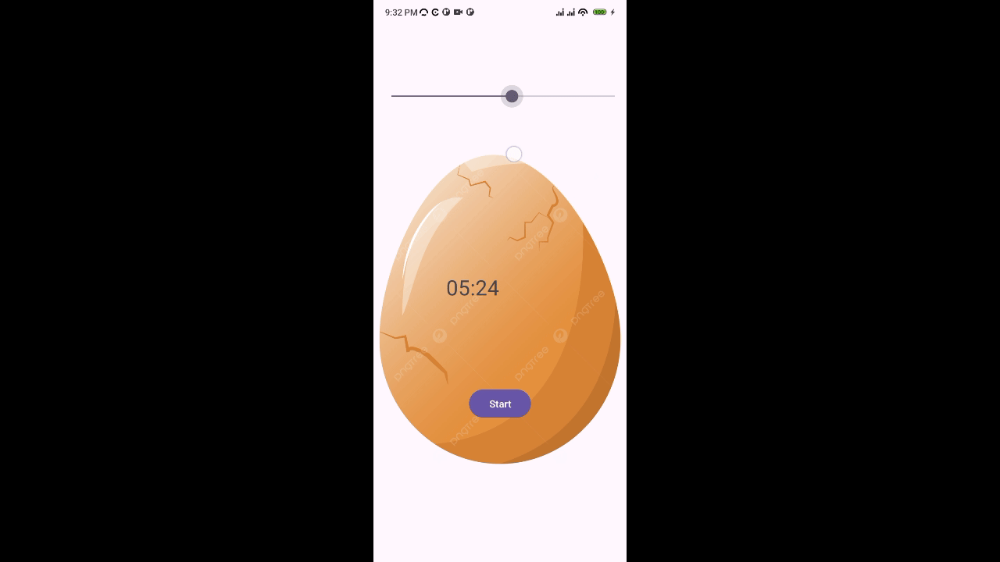

# 🐣 Egg Timer

Egg Timer is a simple Android app that allows users to set a countdown timer for up to 10 minutes. Once the timer reaches 0:00, an image of an egg hatches to reveal a chicken. This app is written in Java.

## 🛠️ Features

- **🎛️ Slider:** Set the countdown timer from 1 minute up to 10 minutes.
- **⏳ Countdown Timer:** Start the timer and see the countdown in real-time.
- **🐣 Egg Animation:** When the timer reaches 0:00, an egg image hatches to reveal a chicken.
- **🎬 Demo GIF:** A demonstration of the app's functionality is provided in a GIF.

## 📥 Installation

1. Clone the repository or download the source code.
2. Open the project in Android Studio.
3. Build and run the app on your device or emulator.

## 🖥️ Usage

1. Open the app.
2. Use the slider to select the desired time (up to 10 minutes).
3. Hit the "Start" button to begin the countdown.
4. Wait for the timer to reach 0:00 and watch the egg hatch to reveal the chicken.

## 🎥 Demo

## 🔧 Technologies Used

- Java
- Android SDK

## 📝 License

This project is licensed under the MIT License.
